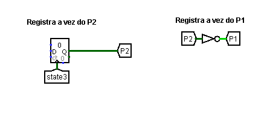

# Projeto Jogo da Memória - Circuitos Digitais

## Índice
- [Sobre o projeto](#sobre-o-projeto);
- [Equipe](#equipe);
- [Simulador](#simulador);
- [Uso](#uso);
- [O circuito](#o-circuito).

## Sobre o projeto

Projeto desenvolvido na disciplina de Circuitos Digitais, do primeiro semestre do bacharelado em Ciência da Computação na Universidade Federal do Cariri (UFCA), com o objetivo de aplicar os conceitos aprendidos em sala sobre estruturas de memória (circuitos sequenciais).
A proposta consiste em um jogo da memória, em que a visualização das "peças" é feita com displays hexadecimais, e os valores escondidos podem ser números de 0 a F (hexadecimais). A jogabilidade é implementada por meio de botões que acionam contadores e registradores, permitindo a escolha de peças, alternância entre jogadores, registro das pontuações e definição de um vencedor.

## Equipe
- [Bruno Macedo (GitHub)](https://github.com/brunom-dev);
- [Sebastião Soares (GitHub)](https://github.com/sebastiaosoares);
- **Professor:** [Ramon Nepomuceno (e-mail institucional)](mailto:ramon.nepomuceno@ufca.edu.br).

## Simulador
O simulador utilizado foi o software de prototipagem, Logisim ([download](https://sourceforge.net/projects/circuit/) - externo).

## Uso
A jogabilidade funciona da forma descrita abaixo.
1. Depois de iniciada a simulação, podem ser utilizados os botões "LINHA" e "COLUNA" para alternar entre as peças.
2. Ao escolher, utiliza-se "CONFIRMA":
   - a primeira vez para escolher uma peça;
   - a segunda, para escolher a próxima peça;
   - e a terceira, para contabilizar a pontuação e mudar de jogador.
3. Após todas as peças serem descobertas, LEDs exibem o vencedor ou indicam empate.

## O circuito
Nesta seção, será detalhada a lógica por trás do Jogo da Memória e o funcionamento do circuito.

     
   <i>Imagem da parte principal do circuito.</i> 

### 1. Registro e captação das coordenadas

     

  
Essa parte do circuito é responsável pela captação e registro das coordenadas selecionadas pelos jogadores no tabuleiro, armazenando-as em linha (LIN) e coluna (COL).

   - <strong>Botões de entrada (LINHA e COLUNA)</strong>  
        Esses botões atuam como sinais de controle para os flip-flops tipo D, responsáveis por registrar as coordenadas. Quando pressionados, alteram os valores das saídas correspondentes à linha (LIN) ou à coluna (COL).

   - <strong>Flip-Flops tipo D</strong>  
        Cada flip-flop registra e armazena o valor correspondente à linha ou coluna. O valor atualizado é exibido na saída ("LIN" e "COL"), representando as coordenadas escolhidas.

   - <strong>Saídas "x" e "y"</strong>  
        As saídas combinadas das coordenadas (x para coluna, y para linha) são utilizadas pelo circuito principal para acessar as posições do tabuleiro.
 

### 2. Gerenciador de Estados

     

  
O gerenciador de estados é responsável por controlar o fluxo de estados do jogo, alternando entre os diferentes estágios da jogabilidade. Ele utiliza um flip-flop tipo D e portas lógicas para definir qual estado o jogo deve estar em um determinado momento.

   - <strong>Flip-Flop tipo D</strong>  
         O flip-flop armazena o estado atual do jogo. Quando o botão "CONFIRMA" é pressionado, ele gera um pulso de clock, permitindo que haja o avanço do estado atual para o próximo.
   - <strong> Portas AND </strong>  
         As portas AND recebem sinais dos estados anteriores e o sinal do botão CONFIRMA para calcular a transição entre os estados state0, state1, state2, e state3.

   - <strong> Estados (state0, state1, state2, state3) </strong>  
         Cada estado corresponde a uma fase específica do jogo:

        - <strong>state0</strong>: Seleção da primeira peça.
        - <strong>state1</strong>: Seleção da segunda peça.
        - <strong>state2</strong>: Confirmação das peças selecionadas.
        - <strong>state3</strong>: Alternância de jogador e atualização da pontuação. Após atingir o state3, a máquina de estados é resetada, retornando ao estado inicial (state0) para reiniciar o processo com o próximo jogador.
 

### 3. Gerenciador dos LED´S

     

  

O demultiplexador (DMX) é responsável por controlar qual LED será aceso, indicando a peça atual que o jogador está percorrendo no tabuleiro. Ele utiliza as coordenadas registradas (XY) para selecionar a saída correspondente.

   - <strong>Entrada do DMX</strong>
      - O valor constante 1 é aplicado à entrada do demultiplexador. Isso significa que ele sempre terá um sinal ativo para ser enviado.
      - A variável de controle são as coordenadas XY (linha e coluna) provenientes do registro de coordenadas. Elas determinam qual saída será ativada.
      
   - <strong>Saídas do DMX</strong>
      - As saídas do demultiplexador correspondem aos túneis correspondente a cada LED do tabuleiro, com cada saída ativando o LED da peça atual que o jogador está percorrendo.
    
Na prática temos que ao navegar pelo tabuleiro utilizando os botões de controle (LINHA e COLUNA), o DMX atualiza a saída correspondente com base no valor das coordenadas registradas, acendendo o LED que indica a posição atual.

 

### 4. Registrador das posições selecionadas

     

  

Este circuito é responsável por armazenar as coordenadas das posições escolhidas no tabuleiro durante as etapas de seleção das peças. Ele utiliza flip-flops tipo D e portas lógicas para gerenciar e registrar as posições para cada jogada.

   - <strong> Entrada de Controle </strong>  
       O botão "CONFIRMA" serve como sinal de controle. Ele é usado para permitir o registro das coordenadas selecionadas, gerando um pulso que ativa o armazenamento nos flip-flops correspondentes.

   - <strong> Estados State0 e State1 </strong>  
        O controle do circuito é dividido em dois estados principais:
       - State0: Registra as coordenadas da primeira peça selecionada (LIN1 e COL1).
       - State1: Registra as coordenadas da segunda peça selecionada (LIN2 e COL2).
       
   - <strong> Flip-Flops Tipo D </strong>   
     Cada flip-flop armazena um valor de coordenada:
     - LIN1 e COL1 armazenam as coordenadas da primeira peça.
     - LIN2 e COL2 armazenam as coordenadas da segunda peça.

   - <strong> Portas AND </strong>   
      As portas AND garantem que o registro só ocorra quando o botão "CONFIRMA" é pressionado e o circuito está no estado correto (state0 ou state1).

   - <strong> Saídas </strong>  
     As combinações das saídas dos flip-flops (savedXY1 e savedXY2) representam as coordenadas armazenadas de cada peça selecionada.

 

### 5. Multiplexadores para Seleção de Peças

     

  

Esses multiplexadores (MUX) são responsaveis por manter a primeira peça selecionada ativa no tabuleiro enquanto o jogador escolhe a segunda peça do par.

- <strong>Entradas</strong>
     - Os multiplexadores recebem entradas que representam as posições possíveis no tabuleiro. Cada posição é associada a uma coordenada (linha e coluna) do tabuleiro.
     - As coordenadas salvas (savedXY1 e savedXY2) são usadas como sinais de controle.
- <strong>MUX 1:</strong> Mantém ativa a posição correspondente à primeira peça selecionada, utilizando as coordenadas salvas em savedXY1
- <strong>MUX 2:</strong> Ativa a posição correspondente à segunda peça selecionada, utilizando as coordenadas salvas em savedXY2
- <strong>Saidas</strong>
     - <strong>valueXY1</strong> Mantém a ativação da primeira peça, garantindo que ela continue iluminada durante a escolha da segunda peça.
     - <strong>valueXY2:</strong> Ativa a segunda peça com base na nova seleção do jogador.
 
Esse é um funcionamento essencial no jogo da memória, pois assim possibilita os jogadores memorizarem as peças e suas respectivas posições durante o andamento do jogo.

 

### 6. Estrutura de Verificação de Acerto

     

  

Estrutura responsável por comparar os valores das peças selecionadas e determinar se houve um acerto, gerando um sinal para indicar o resultado. Ele utiliza comparadores e portas lógica combinacionais para realizar a verificação.

- <strong>Entradas</strong>
   - valueXY1 e valueXY2: Representam os valores das peças selecionadas no tabuleiro. São as saídas dos multiplexadores descritos na Etapa 5.
   - state3: Representa o estado do jogo em que ocorre a verificação de acerto, garantindo que a comparação só seja realizada na etapa correta e contabilize acerto apenas por um instante de pulso.
- <strong>Comparador</strong>
   - O comparador verifica a igualdade entre valueXY1 e valueXY2. e os valores forem iguais, a saída do comparador será ativada (lógica 1), indicando que as peças formar um par correto.
- <strong>Porta AND</strong>
   - A porta AND combina o resultado do comparador com o sinal do estado state3. Isso assegura que o pulso de "acerto" (correct) só será gerado se o jogo estiver no estado de verificação e os valores forem iguais.
- <strong> Saída: correct </strong>
   - A saída correct indica se o jogador acertou ao selecionar as peças. Este sinal é utilizado para atualizar a pontuação como vai ser descrito posteriomente.

### 7. Verificador de acerto de cada peça:

     

  

Agora que temos a indicação de um acerto (**correct**) e as coordenadas salvas das duas últimas peças selecionadas (**savedXY1** e **savedXY2**), podemos criar as estruturas que verificam se cada peça já teve seu par descoberto. Para isso, verifica-se, em cada caso, se uma das coordenadas salvas é igual à coordenada da peça e, caso seja, se receber 1 em **correct**, enviará um pulso de acerto para a peça correspondente por meio da variável **correct_xy**, em que **xy** é a coordenada da peça (**correct_00**, **correct_01**, …, **correct_33**).

Esse pulso de acerto específico de cada peça será, mais à frente, registrado e servirá para indicar que a peça deve permanecer em exibição, por ter tido seu par descoberto.

### 8. Verificadores do estado de exibição dos valores:

     

  

Nesse circuito, temos a intenção de receber, para cada peça, uma variável **vXY**, sendo **XY** sua coordenada, que indique com 0 ou 1 se a peça deve ser exibida.

* Para isso, verifica-se os fatores, em cada peça:
  * Se é a primeira peça selecionada da jogada (**LIN1** e **COL1**) e não está no estado 0 (único que não exibe peça da jogada atual) – estado passageiro;
  * Se for a segunda peça selecionada da jogada (**LIN2** e **COL2**) e está no estado 2 (único que possui a atual segunda peça em exibição) – estado passageiro;
  * Se o registro de **correct_xy** (**xy** sendo a coordenada) for 1, indicando que a peça foi acertada – estado permanente.

Assim, em qualquer um desses casos, conforme indicado na imagem, a peça deve ser exibida. Portanto, o **vXY** da peça **XY** recebe 1.

### 9. Mostrando ou ocultando os valores:

     

  

Já sabemos se os valores devem ser mostrados ou ocultados em cada caso. Em seguida, utilizaremos essas informações para mostrar ou ocultar os valores das peças.

Assim, temos um conjunto de **MUX** que escolhem valor nulo se **vXY** equivaler a 0 (não mostrar) ou escolhem o valor real da peça caso **vXY** equivaler a 1 (mostrar).

**Observação:** os valores de cada peça, nessa versão do projeto, são fixos e definidos em tempo de desenvolvimento, apesar de que uma geração aleatória desses valores pode ser possível.

### 10. Registra a vez de P1 e P2:

     

  

O estado 3 do nosso circuito indica a transição entre uma jogada completa e outra. Então foi utilizado um contador de 1 bit, que varia entre 0 e 1, e é ativado pelo pulso do terceiro estado, indicando então a mudança entre as vezes dos jogadores. Desse modo, a saída do contador é armazenada na variável **P2**, que é positiva quando a vez for do *player 2*, enquanto a variável **P1** recebe o inverso de **P2**, correspondendo à jogada do *player 1*.

### 11. Registra os pontos de P1 e P2:

     

  

Sabendo-se a vez de cada jogador, indicada pelos túneis correspondentes, agora foram inseridos dois contadores, que incrementam ao pulso enviado pelo túnel **correct**, somente se, para o primeiro contador, for a vez do jogador 1 e, para o segundo contador, a vez do jogador 2.

Ou seja:  
**correct** × **!P2**, incrementa **PONTOS P1**.  
**correct** × **P2**, incrementa **PONTOS P2**.

### 12. Exibição do vencedor:

     

  

Essa parte do circuito indica o vencedor. Para isso, primeiro verifica-se se o jogo chegou ao fim, caso as pontuações dos jogadores somem 8 (soma máxima possível ao fim do jogo). Em seguida, compara **PONTOS P1** e **PONTOS P2**. Caso sejam iguais, **win0** recebe 1, indicando empate. Se não, a depender da maior pontuação, **win1** (para o jogador 1) ou **win2** (para o jogador 2) receberá 1 e acionará os LEDs que indicam o vencedor na parte principal do circuito.

### 13. Tratamento de erro de seleção de peça já “aberta”:

     

  

O circuito, após a inclusão de todas as estruturas anteriores, já apresenta bom funcionamento, exceto pelo fato de que selecionar duas vezes a mesma peça, por exemplo, conta como uma jogada válida e acrescenta à pontuação do jogador correspondente.

Sendo assim, para evitar que isso ocorra, foi adicionada uma validação ao ato de confirmar a seleção de uma determinada peça. O túnel responsável por receber a confirmação do jogador é chamado **CONFIRMAR**. Assim, chamamos de **CONFIRMA** o túnel que realmente transportará uma confirmação, caso a peça confirmada pelo usuário *NÃO* esteja "aberta", isto é, não esteja em exibição.

Dessa forma, a validação consiste em descobrir se o verificador da peça confirmada pelo jogador está ligado, por meio de um MUX que escolhe entre os verificadores de cada peça, a partir da posição da peça em questão. Uma observação importante é que, caso estejamos no estado 2, não precisamos nos preocupar com a confirmação sobre uma peça já selecionada, pois essa ação, nesse estado, apenas deve mudar para o estado de verificação.

Logo, **CONFIRMA** = (*state2* + *saída do MUX*) × **CONFIRMAR**, para todos os efeitos que essa confirmação implicar.
